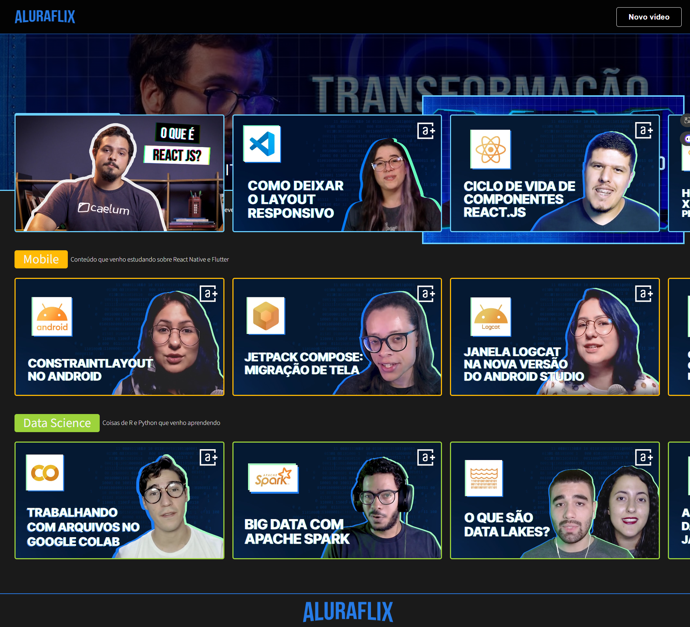
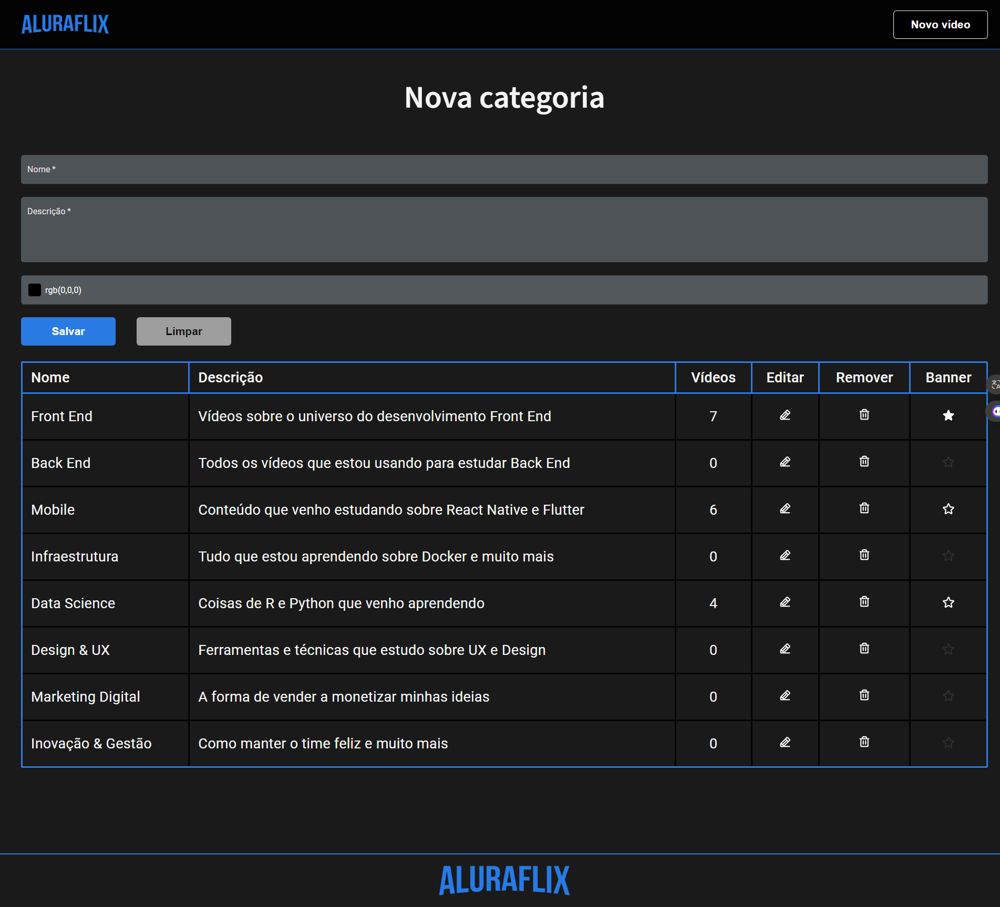
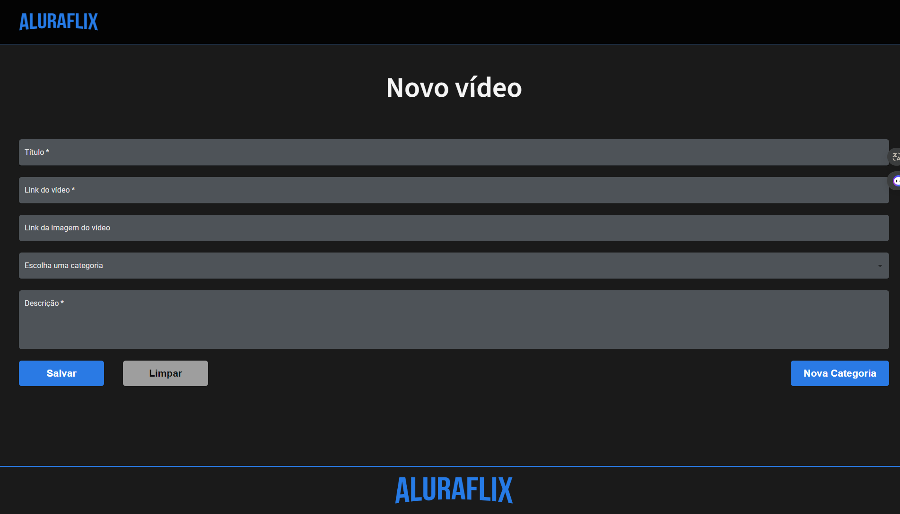

# Projetos Alura Oracle - ONE
 > Oracle Next Education Oracle

[Clique aqui para acessar o site]()

<h2 align="center">Plataforma de vídeos Alura | Alura Flix</h2>

    </img>
    </img>
    </img>

### Modelo Figma 
https://www.figma.com/file/kg8jj2HgSDV9efuhoDtta5/AluraFlix-PT?type=design&node-id=1-106&mode=design&t=pUDit8zCXsUJFRyR-0

### Tecnologias Utilizadas
    - React
    - Next.js
    - Typescript

### Para rodar o projeto
    - npm -d
    - npm run build
    - npm start